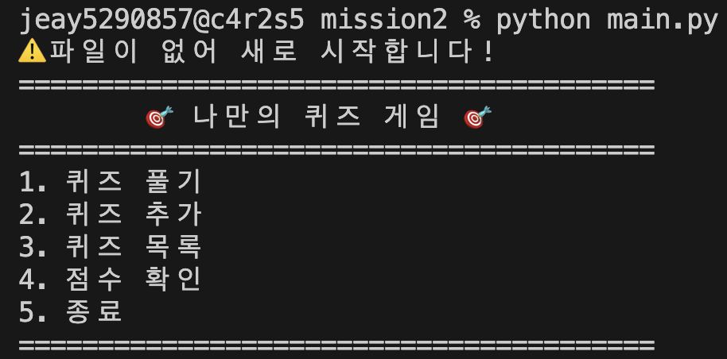

# codyssey_mission2

## 프로젝트 개요

### python 버전

```jsx
Python 3.12.13
git version 2.53.0
```

## 퀴즈 주제 선정 이유

- 넌센스 퀴즈

## 실행 방법

```bash
% python main.py
```

## 기능 목록

- 문제 풀기
    
    
    
    
    
- 문제 추가
    
    
    
- 문제 목록
    
    
    
- 점수 확인
    
    
    
- 잘못된 입력 처리
    
    
    
    
    
    
    
- 프로그램 재시작 후 데이터 유지
    
    
    
    
    

## 파일 구조

```bash
mission2
├── classes/
│   └── class_quiz.py
│   └── class_quizgame.py
└── screenshots/
│   └── add_quiz.png
│   └── list_quiz.png
│   └── load_data.png
│   └── no_data.png
│   └── score.png
│   └── wrong_input.png
├── main.py
├── utils.py
└── [README.md](http://readme.md/)

```

## 데이터 파일 설명(`state.json` 등)

```bash
{
    "quizzes": [
        {
            "question": "1 + 1",
            "choices": [
                "1",
                "2",
                "3",
                "4"
            ],
            "answer": 2
        }
    ],
    "best_score": 100.0
}
```

## 과제 목표

**Python 기초**

- 변수가 무엇이고, 왜 사용하는지 설명할 수 있다.
    - 변수 : 데이터를 저장하는 이름 있는 공간
    - 값을 반복해서 사용하거나 변경하기 위해
- `int`, `str`, `bool`, `list`, `dict`의 차이를 설명할 수 있다.
    - int : 정수, 숫자 저장
    - str : 문자 저장
    - bool : 조건 판단용
    - list : 순서가 있는 여러 값 저장
    - dict : 키-값 쌍 저장
- `if/elif/else`로 조건에 따라 다른 동작을 수행할 수 있다.
    - if : 첫 조건
    - elif : 추가 조건
    - else : 나머지
- `for`와 `while`의 차이를 설명하고 적절히 선택할 수 있다.
    - for : 횟수/목록 반복
    - while : 조건 만족하는 동안 반복
- 함수를 정의하고, 매개변수와 반환값을 활용할 수 있다.

**클래스와 객체**

- 클래스가 무엇이고, 왜 사용하는지 설명할 수 있다.
    - 객체(클래스를 이용해 실제로 만든 데이터)를 만들기 위한 설계도
- `__init__` 메서드와 `self`의 역할을 설명할 수 있다.
    - __ init __ : 객체가 생성될 때 자동 실행되는 초기화 함수
    - self : 현재 생성된 객체 자신
- 클래스의 속성(attribute)과 메서드(method)를 정의하고 활용할 수 있다.
    - 속성 : 객체가 가지는 데이터
    - 메서드 : 클래스 안의 함수
- 클래스 vs 함수
    - 함수는 동작 중심, 필요한 작업 실행
    - 클래스는 상태(데이터)와 행동(함수)를 한 단위로 관리

**파일 입출력**

- 파일을 열고, 읽고, 쓰는 기본 과정을 설명할 수 있다.
    - 열기 → 작업 → 닫기
    
    ```bash
    with open("state.json", "r", encoding="utf-8") as f:
    ```
    
    - with : 자동 close 가능
    - state.json : 파일 이름
    - r : 읽기 모드
        
        ```bash
        data = json.load(f)
        ```
        
    - w : 쓰기 모드
        
        ```bash
        json.dump(data, f)
        ```
        
    - utf-8 : 한글 깨짐 방지
- JSON 형식이 무엇이고, 왜 데이터 저장에 사용하는지 설명할 수 있다.
    - json : 데이터를 문자열 형태로 저장하는 표준 형식
        - key-value 구조
        - 사람이 읽기 쉬움
        - python dict와 매우 비슷
    - 프로그램 종료 후에도 데이터 유지 가능
    - 다시 불러오기 쉬움
    - 다른 언어와 호환 쉬움 (ex. 웹서버)
- `try/except`를 사용하여 오류를 처리할 수 있다.
    - 파일 없는 경우, 권한 없는 경우, 형식이 깨지는 경우의 예외를 위해 많이 사용
    - CtrlC : 현재 실행 중인 작업 강제 종료, 프로세스 종료
    - CtrlD : 입력 종료, 입력 끝/쉘 종료 가능
    - CtrlZ : 현재 작업 일시 정지, 프로세스 suspend

**Git 기초**

- Git이 무엇이고 왜 필요한지 설명할 수 있다.
    - 코드 변경 이력을 기록하고 관리하는 버전 관리 시스템
    - 이전 상태 복구 가능
    - 협업 가능
    - 기능별 분리 가능 (branch)
- `init`, `add`, `commit`, `push`, `pull`, `checkout`, `clone`이 각각 무엇을 하는지 설명할 수 있다.
    - init: 현재 폴더를 git 저장소로 초기화
    - add: 변경 파일을 commit 대상으로 올림
    - commit: 변경사항 기록
    - push: 로컬 commit을 원격 저장소로 업로드
    - pull: 원격 최신 변경 가져오기 + 병합
    - checkout: 브랜치 이동 또는 특정 commit 이동
    - clone: 원격 저장소 전체 복사
- 브랜치를 생성하고 병합할 수 있다.
    - 생성
    
    ```bash
    git branch feature/quiz
    
    git checkout -b feature/quiz
    ```
    
    - 병합
        - 현재 브랜치 ← 대상 브랜치
        - A브랜치 내용을 B브랜치에 합치기
        
        ```bash
        git checkout B
        git merge A
        ```
        
- 원격 저장소를 `clone`하고, `pull`로 변경사항을 가져올 수 있다.
    - clone : 최초 복사
    - pull : 이후 최신 상태 반영

## git log

- 초기 설정 완료 후 첫 번째 `commit`과 `push`를 수행한다.

```jsx
commit 7de40d68f91c5bfc4df02e04319ae4d599e05cc5 (HEAD -> main, origin/main, origin/HEAD)
Author: jeayoungKim529 <jeay529@gmail.com>
Date:   Tue Apr 7 13:49:40 2026 +0900

    초기 설정
```

- 메뉴 기능 완성 후 커밋한다.
- **공통 입력/예외 처리 기준 (최소 요구)**
- Quiz 클래스 작성 후 커밋한다.
- 기본 퀴즈 데이터 작성 후 커밋한다.
- 기능 완성 후 커밋하고 `main` 브랜치로 병합한다.
- 퀴즈 추가 기능 완성 후 커밋한다.
- 퀴즈 목록 기능 완성 후 커밋한다.
- 점수 기능 완성 후 커밋한다.
- 클래스 구조 정리 후 커밋한다.
- 파일 입출력 기능 완성 후 커밋한다.
- README 작성 후 최종 푸시한다.
- **Git 저장소 복제 실습**

## 과제 목표

**Python 기초**

- 변수가 무엇이고, 왜 사용하는지 설명할 수 있다.
    - 변수 : 데이터를 저장하는 이름 있는 공간
    - 값을 반복해서 사용하거나 변경하기 위해
- `int`, `str`, `bool`, `list`, `dict`의 차이를 설명할 수 있다.
    - int : 정수, 숫자 저장
    - str : 문자 저장
    - bool : 조건 판단용
    - list : 순서가 있는 여러 값 저장
    - dict : 키-값 쌍 저장
- `if/elif/else`로 조건에 따라 다른 동작을 수행할 수 있다.
    - if : 첫 조건
    - elif : 추가 조건
    - else : 나머지
- `for`와 `while`의 차이를 설명하고 적절히 선택할 수 있다.
    - for : 횟수/목록 반복
    - while : 조건 만족하는 동안 반복
- 함수를 정의하고, 매개변수와 반환값을 활용할 수 있다.

**클래스와 객체**

- 클래스가 무엇이고, 왜 사용하는지 설명할 수 있다.
    - 객체(클래스를 이용해 실제로 만든 데이터)를 만들기 위한 설계도
- `__init__` 메서드와 `self`의 역할을 설명할 수 있다.
    - __ init __ : 객체가 생성될 때 자동 실행되는 초기화 함수
    - self : 현재 생성된 객체 자신
- 클래스의 속성(attribute)과 메서드(method)를 정의하고 활용할 수 있다.
    - 속성 : 객체가 가지는 데이터
    - 메서드 : 클래스 안의 함수
- 클래스 vs 함수
    - 함수는 동작 중심, 필요한 작업 실행
    - 클래스는 상태(데이터)와 행동(함수)를 한 단위로 관리

**파일 입출력**

- 파일을 열고, 읽고, 쓰는 기본 과정을 설명할 수 있다.
    - 열기 → 작업 → 닫기
    
    ```bash
    with open("state.json", "r", encoding="utf-8") as f:
    ```
    
    - with : 자동 close 가능
    - state.json : 파일 이름
    - r : 읽기 모드
        
        ```bash
        data = json.load(f)
        ```
        
    - w : 쓰기 모드
        
        ```bash
        json.dump(data, f)
        ```
        
    - utf-8 : 한글 깨짐 방지
- JSON 형식이 무엇이고, 왜 데이터 저장에 사용하는지 설명할 수 있다.
    - json : 데이터를 문자열 형태로 저장하는 표준 형식
        - key-value 구조
        - 사람이 읽기 쉬움
        - python dict와 매우 비슷
    - 프로그램 종료 후에도 데이터 유지 가능
    - 다시 불러오기 쉬움
    - 다른 언어와 호환 쉬움 (ex. 웹서버)
- `try/except`를 사용하여 오류를 처리할 수 있다.
    - 파일 없는 경우, 권한 없는 경우, 형식이 깨지는 경우의 예외를 위해 많이 사용

**Git 기초**

- Git이 무엇이고 왜 필요한지 설명할 수 있다.
    - 코드 변경 이력을 기록하고 관리하는 버전 관리 시스템
    - 이전 상태 복구 가능
    - 협업 가능
    - 기능별 분리 가능 (branch)
- `init`, `add`, `commit`, `push`, `pull`, `checkout`, `clone`이 각각 무엇을 하는지 설명할 수 있다.
    - init: 현재 폴더를 git 저장소로 초기화
    - add: 변경 파일을 commit 대상으로 올림
    - commit: 변경사항 기록
    - push: 로컬 commit을 원격 저장소로 업로드
    - pull: 원격 최신 변경 가져오기 + 병합
    - checkout: 브랜치 이동 또는 특정 commit 이동
    - clone: 원격 저장소 전체 복사
- 브랜치를 생성하고 병합할 수 있다.
    - 생성
    
    ```bash
    git branch feature/quiz
    
    git checkout -b feature/quiz
    ```
    
    - 병합
        - 현재 브랜치 ← 대상 브랜치
        - A브랜치 내용을 B브랜치에 합치기
        
        ```bash
        git checkout B
        git merge A
        ```
        
- 원격 저장소를 `clone`하고, `pull`로 변경사항을 가져올 수 있다.
    - clone : 최초 복사
    - pull : 이후 최신 상태 반영
